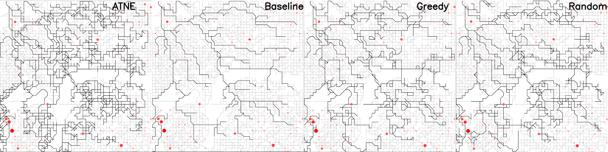
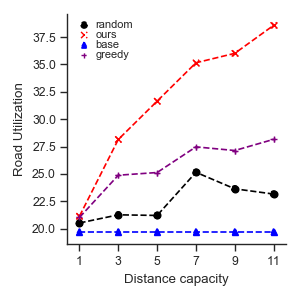

# ANTE-Mobility: Approximated Trajectory Nash Equilibrium #

This is an implementation of ATNE on Python 3, Networkx, and Traci. The system generates vehicle trajectories based on a set of computed nash equilibrium values. The vehicles acts as individual players in a non-cooperative game to derive the optimal strategy for all players in the system.


The repository includes:
* Approximated Trajectory Nash Equilibrium
* Open street map to SUMO Conversion
* Street Discretization

## Getting Started
Download SUMO from [HERE](https://sumo.dlr.de/docs/Downloads.php) and set up system environment variable.

pip install dependencies

```
pip install -r requirements.txt
```

start sample simulation
```
python main.py
```


## Coverage Analysis



## Experiement Design


## SUMO + Traci 
The project is implemented using the traffic simulator [SUMO](https://www.eclipse.org/sumo/), which meets our qualifications for an ideal traffic simulator. The perks of SUMO include, all of the tools necessary to build a road map model from scratch using SUMO's NETEDIT tool or import a real-life road map model from [OpenStreetMaps (OSM)](https://www.openstreetmap.org/#map=5/38.007/-95.844). Furthermore, SUMO may be interfaced using Python 3.0 and [TraCI](https://sumo.dlr.de/docs/TraCI/Interfacing_TraCI_from_Python.html) which allows for management of the traffic simulation at an atomic level. In addition, the Python 3.0 interface of SUMO and TraCI allows for the use of custom Python 3.0 modules that extend the functionality of SUMO.

---

### <a name="sumo_essentials"></a>SUMO Essentials
[Top](#top_of_page) , [Essential Files](#sumo_essentials.essential_files) , [Tools](#sumo_essentials.tools)

<!-- Begin Essential Files -->
### <a name="sumo_essentials.essential_files"></a>Essential Files
[Sumo Essentials](#sumo_essentials) , [*.net.xml](#sumo_essentials.essential_files.net_xml) , [*.rou.xml](#sumo_essentials.essential_files.rou_xml) , [*.settings.xml](#sumo_essentials.essential_files.settings_xml) , [*.sumoconfig](#sumo_essentials.essential_files.sumoconfig)

Every SUMO project must have a few essential Files.
```
1. *.net.xml <-- Contains the map. Generated by netconvert or netedit.
2. *.rou.xml <-- Contains the routes and vehicles.
3. *.sumoconfig <-- Points SUMO to the neccesary files.
4. *.settings.xml <-- (optional) Settings defined for the SUMO-GUI.
```

<!-- begin *.net.xml -->
#### <a name="sumo_essentials.essential_files.net_xml">*.net.xml
The **\*.net.xml** contains all of the neccesary nodes, edges, junctions, intersections etc. that make up the map. This file is generated by combining a **\*.nod.xml** and a **\*.edg.xml** together using netconvert, or automatically when using netedit to create a map.
These files are always auto-generated (i.e. by *netconvert* or *netedit*).

[Essential Files](#sumo_essentials.essential_files) , [netconvert](#sumo_essentials.tools.netconvert) , [netedit](#sumo_essentials.tools.netedit)
<!-- end *.net.xml -->
<!-- being *.rou.xml -->
#### <a name="sumo_essentials.essential_files.rou_xml"></a>*.rou.xml
By convention, these files have the extension **.rou.xml** but are recoginzed by the tag **\<routes\>** within the file. The basic structure of a **\*.rou.xml** file looks like:
```
<routes>
	<vType ... />
	^ One or more vehicle types.
	
	<route ... />
	^ One or more routes.
	
	<vehicle ... />
	  or
	<flow .../>
	^ Either a <vehicle> or <flow> to link the <vType> and <route> together.
</routes>
```
[Essential Files](#sumo_essentials.essential_files)
<!-- end *.rou.xml -->
<!-- begin *.settings.xml -->
#### <a name="sumo_essentials.essential_files.settings_xml"></a>*.settings.xml
By convention, *sumo-gui* configuration files are named with the **.settings.xml** extension. This file is used along with the **\*.sumoconfig** file to define settings for a graphical SUMO simulation. Below we look the graphical configuration file for *my_first_project*.
```
<viewsettings>
	<viewport y="0" x="100" zoom="100" /> <-- Where the visible area begins whent he simulation starts.
	<delay value="100" /> <-- The time between steps. (50+ is reccomended.)
</viewsettings>
```

[Essential Files](#sumo_essentials.essential_files) , [*.sumoconfig](#sumo_essentials.essential_files.sumoconfig)
<!-- end *.settings.xml -->
<!-- begin *.sumoconfig -->
#### <a name="sumo_essentials.essential_files.sumoconfig"></a>*.sumoconfig
By convention, the SUMO configuration files are named with the **.sumoconfig** extension but are recognized by the tag **\<configuration\>** within the file. This file is an XML file with pointers to other essential files and settings for running the simulation without the graphical user interface. Below we look a the coniguration file for *my_first_project*.
```
<configuration>
	<input>
		<net-file value="mfp.net.xml" /> <-- The map.
		<route-files value="mfp.rou.xml /> <--- The route the cars travel.
		<gui-settings-file value="mfp.settings.xml" /> <-- Settings for sumo-gui
	</input>
	^ We must point to the critical files here.
	
	<time>
		<begin value="0" /> <-- Start time of the simulation.
		<end value="10000" /> <-- end time of the simulation.
	</time>
</configuration>
```
[Essential Files](#sumo_config.essential_files) , [*.net.xml](#sumo_essentials.essential_files.net_xml) , [*.rou.xml](#sumo_essentials.essential_files.rou_xml) , [*.settings.xml](#sumo_essentials.essential_files.settings_xml)
<!-- end *.sumoconfig -->
<!-- End Essential Files -->

<!-- Begin tools -->
### <a name="sumo_essentials.tools"></a>Tools
[Sumo Essentials](#sumo_essentials) , [netconvert](#sumo_essentials.tools.netconvert) , [netedit](#sumo_essentials.tools.netedit) , [sumo-gui](#sumo_essentials.tools.sumo_gui)

This section covers the various tools that are provided by the SUMO software.

<!-- Begin netconvert -->
#### <a name="sumo_essentials.tools.netconvert"></a>netconvert

>Quentin: The official documentation for *netconvert* can be found on the [NETCONVERT page](http://sumo.dlr.de/wiki/NETCONVERT) of the [SUMO wiki](http://sumo.dlr.de/wiki/Simulation_of_Urban_MObility_-_Wiki).

The purpose of *netconvert* is the create **\*.net.xml** files, which are the map files SUMO uses for it's simulations.

The filepath for *netconvert* is:
```
~/src/sumo-0.30.0/bin/netconvert
```
Additionally, *netconvert* may be called from anywhere in the command line by using:
```
netconvert
```
Below is an example of how we created the *mfp.net.xml* file in the *my_first_project* project.
```
netconvert --node-files=mfp.nod.xml --edge-files=mfp.edg.xml --output-file=mfp.net.xml
```

[Tools](#sumo_essentials.tools)
<!-- End netconvert -->
<!-- begin netedit -->
#### <a name="sumo_essentials.tools.netedit"></a>netedit
>Quentin: The official documention for *netedit* can be found on the [NETEDIT page](http://sumo.dlr.de/wiki/NETEDIT) of the [SUMO wiki](http://sumo.dlr.de/wiki/Simulation_of_Urban_MObility_-_Wiki).

*netedit* is a graphical map creator for SUMO. It's user interface shares much of the same functionality and shortcuts of *sumo-gui*. *Netconvert* is incorporated into *netedit*. By convention, *netedit* files should be saved with the extension of **.net.xml**.

The filepath for *netedit* is:
```
~/src/sumo-0.30.0/bin/netedit
```
Additionally, *netedit* may be called from anywhere in the command line by using:
```
netedit
```
When opening a map in *netedit* from the command line, point it to the **\*.net.xml** file like below when used to open **intersection_1.net.xml**:
```
netedit interesection_1.net.xml
```

[Tools](#sumo_essentials.tools)
<!-- end netedit -->
<!-- begin sumo-gui -->
#### <a name="sumo_essentials.tools.sumo_gui"></a>sumo-gui
*sumo-gui* is the grahical user interface used for running SUMO simulations. It shares much of the same functionality and shortcuts of *netedit*.

The filepath for *sumo-gui* is:
```
~/src/sumo-0.30.0/bin/sumo-gui
```
Additionally, *sumo-gui* may be called from anywhere in the command line by using:
```
sumo-gui
```
We can open any SUMO simulation directly from the command line by pointing *sumo-gui* to the **\*.sumoconfig** file with the **-c** flag


[Tools](#sumo_essentials.tools)
<!-- end sumo-gui -->

<!-- End tools -->
---
